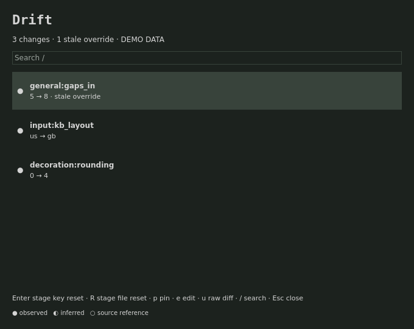

Reads local Omarchy config baselines and matching regular files in ~/.config; writes ~/.local/state/drift; terminal-reviewed resets also write the selected user config after backing it up; executes local CLI collectors and explicit actions; no network; no root.

# Drift

<p>
<a href="https://github.com/tcballard/omarchy-plugin-drift/actions/workflows/test.yml"></a>
<a href="LICENSE"></a>
<a href="https://github.com/tcballard/omarchy-badges"></a>
</p>

**Development preview 0.1.0-preview.1** — built using Omarchy Plugin Skills v0.4.0.

Dependencies (review and install yourself):

```sh
pacman -S nodejs jq git bash
```

Optional: your editor (EDITOR, default nvim), diff and a supported terminal for review/reset actions. Alacritty, Ghostty and Kitty are supported; TERMINAL must be an executable name/path without embedded arguments. No packages, hooks or shell configuration are installed by the plugin loader.



## Use

Add this standalone Git repository with `omarchy plugin add https://github.com/tcballard/omarchy-plugin-drift.git`, review it, then enable `io.github.tcballard.drift` and place its widget in the bar. Development preview source is available in this repository; no tagged release or marketplace approval is claimed.

The panel is native QML in Quattro. Click to open; j/k or arrows select; / searches; Escape closes. Enter stage unique-key reset; R stage whole-file reset; p pin current difference; e edit; u raw diff. Commands that change files, deployments, plugins or processes are staged in a terminal: Enter is the review/execute boundary.

Config is optional: `~/.config/drift/config.json` (XDG overrides respected). Copy `config.example.json` only if you need to change defaults. State is `~/.local/state/drift/`. Updates do not replace either directory.

`omarchy-shell io.github.tcballard.drift refresh` requests a refresh; `status` returns a bounded status summary. The built-in trusted bar can resolve the service. A third-party replacement bar may not have service access; the widget reports unavailable.

## Behavior and limits

The first observation establishes history. Stale overrides require a later baseline change. Only unique .conf keys can be reset individually; repeated keys and non-.conf formats require raw diff/file review. Defaults are copied-config baselines, not an interpreter for arbitrary Lua or include graphs. Symlink/theme/current files are excluded. Pins are content-bound. Staged reset hashes reject concurrent edits. See [the original contract record](docs/ORIGINAL-CONTRACTS.md) for baseline evidence.

Complements configuration editors and theme tools; never treats an intentional theme switch as a config restore request.

## Verify

`./tests/run` runs model tests and portable manifest validation. On Omarchy also run `omarchy plugin validate .` and test actual enable/disable, IPC, orientation, monitor and terminal behavior. The screenshot uses real Panel.qml with host stubs and fictional data; it is not a live desktop screenshot.

## Remove

Disable/remove through Omarchy. Collection stops with the hosted service. User configuration and state remain intentionally.

Apache-2.0. Contributions require DCO sign-off (`git commit -s`).

## Update and remove

Install with `omarchy plugin add https://github.com/tcballard/omarchy-plugin-drift.git`. Then:

```sh
omarchy plugin enable io.github.tcballard.drift
omarchy plugin update io.github.tcballard.drift
omarchy plugin disable io.github.tcballard.drift
omarchy plugin remove io.github.tcballard.drift
```

## Compatibility

Targets the Quattro hosted service/bar-widget API. No live Omarchy version or supported version range is certified by this preparation. Node 22+ is required. See [verification](VERIFICATION.md) and [remaining scope](docs/STATUS.md).
